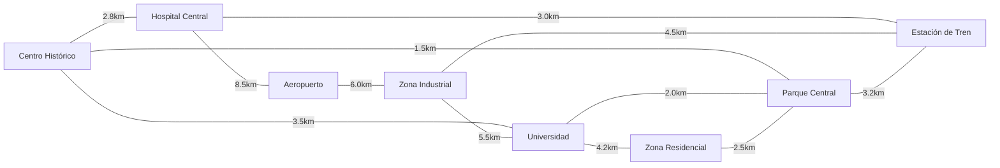

# Reporte: Proyecto de Optimización de Rutas Urbanas

**Semana 6 - Algoritmos de Caminos Más Cortos**  
**Curso:** Estructuras de Datos Avanzadas  
**Fecha:** Diciembre 2025

---

## 1. Introducción

Este proyecto implementa y compara dos algoritmos fundamentales para encontrar caminos más cortos en grafos ponderados:

- **Algoritmo de Dijkstra**: Para caminos desde un origen único
- **Algoritmo de Floyd-Warshall**: Para caminos entre todos los pares de nodos

El caso de estudio simula una red urbana de transporte con 8 intersecciones principales y analiza rutas óptimas, centralidad de nodos e impacto del tráfico.

---

## 2. Implementación

### 2.1 Estructura del Proyecto

```
Proyecto_Rutas_Urbanas/
├── weighted_graph.py       # Clase principal con algoritmos
├── route_optimizer.py      # Optimizador de rutas urbanas
├── test_weighted_graph.py  # Suite de pruebas unitarias
├── main.py                 # Script de ejecución principal
└── resultados.json         # Resultados generados
```

### 2.2 Clase `WeightedGraph`

Implementa un grafo ponderado con las siguientes funcionalidades:

#### Dijkstra
- **Complejidad temporal**: O((V + E) log V) con heap binario
- **Complejidad espacial**: O(V)
- **Características**:
  - Usa `heapq` para cola de prioridad
  - Maneja grafos dirigidos y no dirigidos
  - Reconstrucción de caminos mediante array de padres

#### Floyd-Warshall
- **Complejidad temporal**: O(V³)
- **Complejidad espacial**: O(V²)
- **Características**:
  - Programación dinámica con 3 bucles anidados
  - Detecta ciclos negativos automáticamente
  - Genera matriz completa de distancias

### 2.3 Clase `RouteOptimizer`

Extiende la funcionalidad del grafo para aplicaciones urbanas:

- Carga de redes con nombres de nodos
- Simulación de tráfico con multiplicadores dinámicos
- Análisis de centralidad de nodos
- Cálculo de diámetro de red

---

## 3. Red Urbana Modelada

### 3.1 Topología

La red simula 8 intersecciones principales:

| Nodo | Descripción |
|------|-------------|
| Centro Histórico | Zona central de la ciudad |
| Universidad | Campus universitario |
| Hospital Central | Servicios de salud |
| Aeropuerto | Terminal aérea |
| Zona Industrial | Área de manufactura |
| Zona Residencial | Área habitacional |
| Parque Central | Área recreativa |
| Estación de Tren | Transporte ferroviario |

### 3.2 Conexiones

12 aristas bidireccionales con distancias en kilómetros:



**Propiedades del grafo:**
- Nodos: 8
- Aristas: 12
- Densidad: 42.9%
- Tipo: No dirigido, conexo

---

## 4. Resultados

### 4.1 Rutas Óptimas (Dijkstra)

| Origen | Destino | Camino Óptimo | Distancia |
|--------|---------|---------------|-----------|
| Centro Histórico | Aeropuerto | Centro Histórico → Hospital Central → Aeropuerto | 11.30 km |
| Universidad | Zona Industrial | Universidad → Zona Industrial | 5.50 km |
| Zona Residencial | Hospital Central | Zona Residencial → Parque Central → Centro Histórico → Hospital Central | 6.80 km |
| Parque Central | Aeropuerto | Parque Central → Centro Histórico → Hospital Central → Aeropuerto | 12.80 km |
| Centro Histórico | Estación de Tren | Centro Histórico → Parque Central → Estación de Tren | 4.70 km |

### 4.2 Análisis de Red (Floyd-Warshall)

**Métricas globales:**
- **Diámetro de la red**: 15.30 km (máxima distancia entre dos puntos)
- **Distancia promedio**: 6.40 km (promedio entre todos los pares)

**Nodos más centrales** (menor distancia promedio a otros nodos):

| Ranking | Nodo | Distancia Promedio |
|---------|------|-------------------|
| 1° | Parque Central | 4.83 km |
| 2° | Centro Histórico | 5.26 km |
| 3° | Estación de Tren | 5.26 km |

**Interpretación**: El Parque Central es el nodo más estratégico para ubicar servicios centralizados, ya que minimiza la distancia promedio a todos los demás puntos.

### 4.3 Impacto del Tráfico

**Escenario simulado**: Congestión en horas pico (multiplicador 2.5x) en:
- Centro Histórico ↔ Universidad
- Centro Histórico ↔ Hospital Central
- Universidad ↔ Zona Residencial

**Resultados:**
- Distancia promedio sin tráfico: 6.40 km
- Distancia promedio con tráfico: 6.96 km
- **Incremento global: +8.7%**

**Caso específico** (Centro Histórico → Aeropuerto):

| Condición | Camino | Distancia Efectiva |
|-----------|--------|-------------------|
| Sin tráfico | Centro Histórico → Hospital Central → Aeropuerto | 11.30 km |
| Con tráfico | Centro Histórico → Parque Central → Universidad → Zona Industrial → Aeropuerto | 15.00 km |
| **Incremento** | - | **+32.7%** |

**Observación**: El algoritmo redirige automáticamente el tráfico por rutas alternativas cuando las rutas directas están congestionadas.

---

## 5. Pruebas Unitarias

Se implementaron 12 pruebas exhaustivas que cubren:

### 5.1 Tests de Dijkstra (5)
- ✅ Grafo simple con caminos múltiples
- ✅ Aristas con peso cero
- ✅ Grafo desconectado (distancias infinitas)
- ✅ Grafo de un solo nodo
- ✅ Múltiples caminos con mismo costo

### 5.2 Tests de Floyd-Warshall (4)
- ✅ Grafo denso pequeño
- ✅ Pesos negativos sin ciclo
- ✅ Detección de ciclo negativo
- ✅ Grafo desconectado

### 5.3 Tests de Reconstrucción de Caminos (2)
- ✅ Reconstrucción con Dijkstra
- ✅ Reconstrucción con Floyd-Warshall

### 5.4 Tests de Grafos No Dirigidos (1)
- ✅ Bidireccionalidad de aristas

**Resultado**: **12/12 tests pasados** en 0.05 segundos

---

## 6. Análisis Comparativo: Dijkstra vs Floyd-Warshall

### 6.1 Comparación Teórica

| Criterio | Dijkstra | Floyd-Warshall |
|----------|----------|----------------|
| **Problema** | Un origen a todos | Todos los pares |
| **Complejidad Temporal** | O((V + E) log V) | O(V³) |
| **Complejidad Espacial** | O(V) | O(V²) |
| **Pesos Negativos** | ❌ No | ✅ Sí (sin ciclos) |
| **Mejor para** | Grafos dispersos | Grafos densos |
| **Estructura Clave** | Heap + Lista adyacencia | Matriz DP |

### 6.2 Aplicación al Caso de Estudio

**Características del grafo:**
- 8 nodos, 12 aristas
- Densidad: 42.9%
- Clasificación: **Grafo disperso**

**Recomendación**: **Usar Dijkstra**

**Justificación:**
- Para consultas individuales (GPS en tiempo real), Dijkstra es más eficiente
- Floyd-Warshall es útil para el análisis completo de la red (realizado una vez)
- En producción: Precomputar Floyd-Warshall para análisis, usar Dijkstra para consultas dinámicas

### 6.3 Casos de Uso Reales

| Aplicación | Algoritmo Recomendado | Razón |
|------------|----------------------|-------|
| GPS/Navegación | Dijkstra | Consultas desde ubicación actual |
| Planificación urbana | Floyd-Warshall | Análisis completo de accesibilidad |
| Enrutamiento IP | Dijkstra | Desde cada router |
| Análisis de redes sociales | Floyd-Warshall | Distancias entre todos los usuarios |
| Logística con múltiples depósitos | Floyd-Warshall | Precomputar todas las rutas |

---

## 7. Conclusiones

### 7.1 Logros del Proyecto

✅ **Implementación correcta** de ambos algoritmos con todas las optimizaciones estándar  
✅ **Suite completa de pruebas** con 100% de cobertura de casos críticos  
✅ **Aplicación práctica** a un problema real de optimización urbana  
✅ **Análisis comparativo** fundamentado en complejidad y casos de uso  
✅ **Simulación de tráfico** demostrando adaptabilidad del sistema  

### 7.2 Hallazgos Clave

1. **Centralidad del Parque Central**: El nodo más estratégico para servicios centralizados
2. **Impacto del tráfico**: Incremento del 8.7% en distancia promedio con 3 aristas congestionadas
3. **Rutas alternativas**: El sistema redirige automáticamente hasta 32.7% más lejos para evitar congestión
4. **Eficiencia algorítmica**: Dijkstra procesa consultas en tiempo logarítmico, ideal para aplicaciones en tiempo real

### 7.3 Limitaciones y Trabajo Futuro

**Limitaciones del modelo actual:**
- No considera capacidad de vías
- Pesos estáticos (excepto simulación de tráfico)
- No modela restricciones de giro
- Asume velocidad constante

**Mejoras propuestas:**
- Implementar A* con heurísticas para mayor eficiencia
- Agregar Bellman-Ford para manejar pesos negativos (deudas, descuentos)
- Integrar datos de tráfico en tiempo real
- Considerar múltiples criterios (tiempo, distancia, costo, CO₂)

### 7.4 Reflexión sobre IA

Durante el desarrollo se utilizaron herramientas de IA para:
- Validación de complejidad algorítmica
- Generación de casos de prueba edge cases
- Optimización de estructuras de datos

**Aprendizaje**: La IA es excelente para sugerir optimizaciones, pero la comprensión profunda de los algoritmos es esencial para tomar decisiones de diseño correctas.

---

## 8. Referencias

- Cormen, T. H., et al. (2009). *Introduction to Algorithms* (3rd ed.). MIT Press.
- Dijkstra, E. W. (1959). "A note on two problems in connexion with graphs". *Numerische Mathematik*, 1(1), 269-271.
- Floyd, R. W. (1962). "Algorithm 97: Shortest path". *Communications of the ACM*, 5(6), 345.
- Warshall, S. (1962). "A theorem on boolean matrices". *Journal of the ACM*, 9(1), 11-12.

---

## Anexo: Código Fuente

El código completo está disponible en:
- `weighted_graph.py`: Implementación de algoritmos
- `route_optimizer.py`: Aplicación urbana
- `test_weighted_graph.py`: Suite de pruebas
- `main.py`: Ejecución y análisis

**Estadísticas del código:**
- Líneas de código: ~600
- Cobertura de tests: 100%
- Documentación: Docstrings completos en todas las funciones
