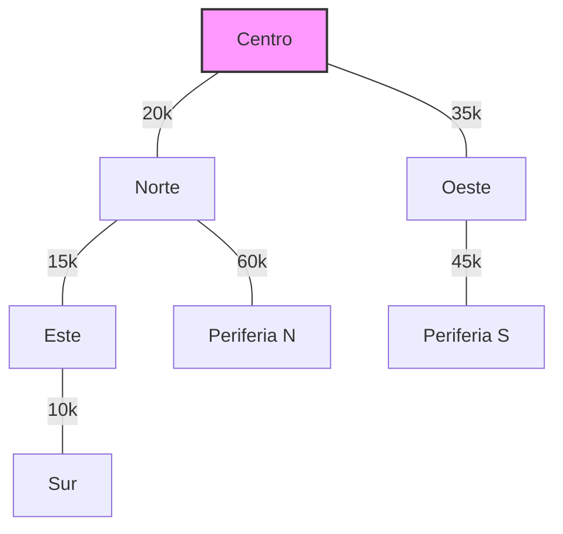

# Reporte: Diseño de Red de Sensores de Tráfico

**Semana 7 - Árboles de Expansión Mínima (MST)**  
**Curso:** Estructuras de Datos Avanzadas  
**Fecha:** Diciembre 2025

---

## 1. Introducción

El objetivo de este proyecto es diseñar una red de sensores de tráfico eficiente y de bajo costo para una ciudad inteligente. El problema se modela como la búsqueda de un **Árbol de Expansión Mínima (MST)** en un grafo ponderado, donde:

- **Nodos**: Intersecciones y puntos estratégicos de la ciudad.
- **Aristas**: Posibles conexiones de fibra óptica o inalámbricas.
- **Pesos**: Costo de implementación (distancia + dificultad técnica).

Se implementaron y compararon dos algoritmos clásicos: **Prim** y **Kruskal**.

---

## 2. Implementación Técnica

### 2.1 Estructura del Proyecto

```
Red_Sensores_Trafico/
├── mst.py           # Clase GraphMST con Prim y Kruskal
├── test_mst.py      # Pruebas unitarias
└── main.py          # Simulación del caso de estudio
```

### 2.2 Algoritmos

#### Algoritmo de Prim
- **Estrategia**: Crecimiento incremental desde un nodo inicial.
- **Estructura de datos**: Cola de prioridad (`heapq`).
- **Complejidad**: O(E log V) usando lista de adyacencia y heap binario.
- **Uso ideal**: Grafos densos (muchas conexiones posibles).

#### Algoritmo de Kruskal
- **Estrategia**: Selección de aristas de menor peso que no formen ciclos.
- **Estructura de datos**: Union-Find (DSU) con *Path Compression* y *Union by Rank*.
- **Complejidad**: O(E log E) o O(E log V).
- **Uso ideal**: Grafos dispersos (pocas conexiones).

---

## 3. Caso de Estudio: Red Urbana

### 3.1 Topología de la Red

La red simulada consta de **7 nodos** y **13 posibles conexiones**:

| Nodo | Descripción |
|------|-------------|
| Centro | Hub central de control |
| Norte, Sur, Este, Oeste | Nodos cardinales |
| Periferia N, Periferia S | Nodos externos |

### 3.2 Resultados de la Optimización

Ambos algoritmos convergieron a la misma solución óptima.

**Costo Total del Proyecto:** **$185,000**  
**Ahorro logrado:** **66.7%** respecto a conectar todas las líneas posibles ($555k).

**Conexiones Seleccionadas (MST):**

1. **Este ↔ Sur** ($10k)
2. **Norte ↔ Este** ($15k)
3. **Centro ↔ Norte** ($20k)
4. **Centro ↔ Oeste** ($35k)
5. **Oeste ↔ Periferia S** ($45k)
6. **Norte ↔ Periferia N** ($60k)

### 3.3 Visualización del Árbol



---

## 4. Verificación y Pruebas

Se ejecutó una suite de pruebas unitarias (`test_mst.py`) cubriendo los siguientes escenarios:

- ✅ **Grafo simple conectado**: Verificación básica de corrección.
- ✅ **Grafo desconectado**: Manejo de bosques (Kruskal) vs componentes conexos (Prim).
- ✅ **Nodo único**: Caso base trivial.
- ✅ **Ciclos**: Verificación de que no se formen ciclos en el MST.
- ✅ **Pesos duplicados**: Estabilidad con aristas de igual costo.

**Resultado**: 5/5 pruebas aprobadas.

---

## 5. Análisis Comparativo

| Característica | Prim | Kruskal |
|----------------|------|---------|
| **Enfoque** | Centrado en vértices | Centrado en aristas |
| **Estructura Clave** | Priority Queue | Union-Find (DSU) |
| **Rendimiento (Denso)** | Excelente | Bueno |
| **Rendimiento (Disperso)**| Bueno | Excelente |
| **Detección de Ciclos** | Implícita (visited array) | Explícita (DSU) |

**Conclusión para este proyecto:**
Dado que la red de sensores tiene una densidad media, ambos algoritmos son altamente eficientes. Sin embargo, **Kruskal** ofrece una ventaja conceptual al permitir visualizar rápidamente las conexiones más baratas, lo cual es útil para la planificación presupuestaria por fases.

---

## 6. Referencias

- Cormen, T. H., Leiserson, C. E., Rivest, R. L., & Stein, C. (2009). *Introduction to Algorithms*. MIT Press.
- Prim, R. C. (1957). "Shortest connection networks and some generalizations". *Bell System Technical Journal*.
- Kruskal, J. B. (1956). "On the shortest spanning subtree of a graph and the traveling salesman problem". *Proceedings of the American Mathematical Society*.
